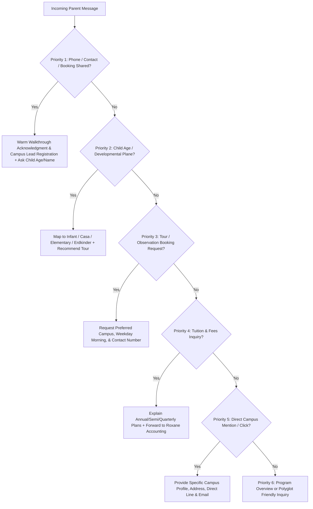

# The Abba's Orchard School — 24/7 AI Admissions Digital Employee & Prototype Project

**Last Updated:** October 7, 2026  
**Project Owner / Principal Developer:** Jason Velasquez (SETHCON)  
**Client / Stakeholders:** Sir Angelo, Sir Ram, Mr. Xavier, Dr. Maria Angelica Paez-Barrameda ("Teacher Ann"), Joseph Christopher N. Barrameda ("Mr. Chris")  
**Target Organization:** The Abba's Orchard School (15+ Campuses nationwide — Luzon, Visayas, Mindanao)  
**Official School Website:** [https://www.theabbasorchard.edu.ph/](https://www.theabbasorchard.edu.ph/)  
**Live Production App:** [https://abbas-orchard-ai.vercel.app](https://abbas-orchard-ai.vercel.app)  
**GitHub Repository:** [https://github.com/jasonvelasquez1410/abbas-orchard-ai](https://github.com/jasonvelasquez1410/abbas-orchard-ai)  

---

## 📌 1. Project Overview & Scope
Activation of an intelligent, multi-campus, polyglot (Bisaya / Tagalog / English) **24/7 AI Admissions Digital Employee & Montessori Guide** embedded into:
1. **Official Website Chat Widget:** Embedded into `theabbasorchard.edu.ph` (Laravel/Inertia stack) via drop-in widget `abbas-widget-embed.js`.
2. **Facebook Messenger Integration:** Official Meta Graph API integration with The Abba's Orchard Facebook page (`facebook.com/abbasorchardschool/`).
3. **Multi-Campus Knowledge System:** 15+ branches across Luzon, Visayas, and Mindanao (Alwana CDO, Bukidnon La Granja, Davao Obrero/Mandug, Cebu Magsaysay/Tandang Sora, Taguig BGC McKinley & Bayani Rd, Greenhills, Alabang, Antipolo, QC Bridgetowne, Canlubang Laguna, Iloilo).
4. **True Montessori® & AMI Pedagogical Persona:** Trained in authentic Association Montessori Internationale (AMI) philosophy across Infant Community (14m–3y), Casa dei Bambini (3–6y), Elementary (6–12y), and Erdkinder adolescent farm boarding (12–18y).
5. **Staff Escalation Workflow:** Automated structured lead auto-dispatching (`<!-- DISPATCH: {...} -->`) with routing to campus coordinators and Ms. Roxane's accounting desk for custom requests and fee schedules.

---

## 💰 2. Agreed Commercial Terms & Pricing
* **One-Time Setup & Custom Training:** **₱28,000**
  * Multi-campus knowledge ingestion & configuration.
  * Custom styled website chat widget & standalone simulator.
  * Facebook Messenger Meta API integration & webhook configuration.
  * Multi-lingual prompt tuning (Bisaya, English, Tagalog).
  * Staff handoff and notification pipeline.
* **Monthly Maintenance & Retainer:** **₱2,500 / month**
  * Server hosting & 24/7 uptime monitoring.
  * AI token usage & Meta API quota coverage.
  * Continuous knowledge updates (school calendar, events, fee announcements).
  * Monthly conversation audit & developer support.

---

## 🚀 3. Live Cloud Architecture & Deployment Stack

### A. Production Hosting & Repository
* **Platform:** Vercel Serverless
* **URL:** `https://abbas-orchard-ai.vercel.app`
* **Git Remote:** `origin/main` (`https://github.com/jasonvelasquez1410/abbas-orchard-ai.git`)

### B. Backend Serverless Functions (`/api`)
* `api/chat.js`: Real-time streaming & JSON admissions AI endpoint powered by **Google Gemini 2.0 Flash** / OpenAI with priority-based lead capture, language detection, and fallback resolution.
* `api/webhook.js`: Production Meta Graph API webhook endpoint supporting:
  * `GET /api/webhook`: Meta Webhook Challenge verification (`hub.verify_token`, `hub.challenge`).
  * `POST /api/webhook`: Instant Facebook Messenger event processing, typing indicator trigger, Gemini AI generation, and message dispatch via Send API.
* `vercel.json`: Edge routing configuration and API rewrites.

### C. Environment Variables on Vercel
* `GEMINI_API_KEY`: Google AI Studio production API key for Gemini 2.0 Flash.
* `AI_PROVIDER`: `gemini` (or `openai`)
* `AI_MODEL`: `gemini-2.0-flash`
* `META_VERIFY_TOKEN`: Verification token matching Meta Developer App webhook settings.
* `META_PAGE_ACCESS_TOKEN`: Page access token for message dispatching.

---

## 🧠 4. Conversational Intelligence & Priority-Based Decision Engine

The admissions AI is specifically tuned to behave like a **warm, kind, and knowledgeable Montessori Admissions Administrator**—not a robotic keyword chatbot.

### Decision Hierarchy (Engine Priority)

### Lead Capture & Booking Example
* **Parent Input:** `"cdo alwana. weekday morning, 09989576496"`
* **AI Output:**
  > *Thank you so much! 🌿 We are delighted to receive your details for a classroom observation walkthrough at our **Cagayan de Oro — Alwana Campus**.*
  >
  > *I have registered your visit request with our admissions team:*
  > • 📍 **Target Campus:** Cagayan de Oro — Alwana Campus  
  > • 📞 **Captured Contact Number:** **09989576496**  
  > • ⏰ **Preferred Schedule:** weekday morning observation window (8:30 AM – 11:00 AM)  
  > • 📧 **Designated Admissions Coordinator:** **alwana@theabbasorchard.edu.ph** | (0917) 707 2668  
  >
  > *Our campus coordinator has been notified and will reach out to you shortly to confirm your observation pass and provide walkthrough instructions.*  
  >
  > *May I also ask your **child's current age or name** so our Montessori Directress can prepare the appropriate prepared environment (Infant Community, Casa, or Elementary) for your visit?*
  >
  > `<!-- DISPATCH: {"campus": "Cagayan de Oro - Alwana", "to": "alwana@theabbasorchard.edu.ph", "subject": "Confirmed Walkthrough Booking Request", "parentName": "Prospective Parent", "parentContact": "09989576496", "details": "Parent booked walkthrough: cdo alwana. weekday morning, 09989576496"} -->`

---

## 🗺️ 5. Official Campus Directory & Lead Routing Map

| Campus Location | Level / Programs | Email Routing | Direct Line |
|---|---|---|---|
| **Bukidnon — La Granja Estates** | IC, Casa, Elementary, Erdkinder Farm Boarding | `lagranja@theabbasorchard.edu.ph` | (0917) 508 2668 |
| **Cagayan de Oro — Alwana** | Infant Community, Casa, Elementary | `alwana@theabbasorchard.edu.ph` | (0917) 707 2668 |
| **Davao City — Obrero & Mandug** | IC, Casa, Elementary, Erdkinder | `davao@theabbasorchard.edu.ph` | (0917) 707 2669 |
| **Cebu City — Magsaysay & Tandang Sora** | Infant Community, Casa, Elementary | `cebu@theabbasorchard.edu.ph` | (0917) 321 2668 |
| **Iloilo — Sta. Barbara Heights** | Casa dei Bambini, Elementary | `iloilo@theabbasorchard.edu.ph` | (0917) 322 2668 |
| **Taguig — BGC McKinley Hill** | Infant Community, Casa, Elementary | `mckinleyhill@theabbasorchard.edu.ph` | (0917) 854 2668 |
| **Taguig — Bayani Road (AFPOVAI)** | Casa dei Bambini, Elementary | `bayani@theabbasorchard.edu.ph` | (0917) 854 2669 |
| **Muntinlupa — Alabang (Filinvest City)** | Infant Community, Casa, Elementary | `alabang@theabbasorchard.edu.ph` | (0917) 855 2668 |
| **Mandaluyong — Greenhills / Wack-Wack** | Infant Community, Casa, Elementary | `greenhills@theabbasorchard.edu.ph` | (0917) 856 2668 |
| **Antipolo City — Taktak Road** | Infant Community, Casa, Elementary | `antipolo@theabbasorchard.edu.ph` | (0917) 857 2668 |
| **Quezon City — Calle Industria (Bridgetowne)** | Infant Community, Casa, Elementary | `calleindustria@theabbasorchard.edu.ph` | (0917) 858 2668 |
| **Canlubang — Carmelray Laguna** | Casa dei Bambini, Elementary | `carmelray@theabbasorchard.edu.ph` | (0917) 859 2668 |
| **Central Admissions & Accounting Desk** | Central Desk & Fee Schedules (Ms. Roxane) | `admission_application@theabbasorchard.edu.ph` / `accounting@theabbasorchard.edu.ph` | (0917) 508 2668 |

---

## 🛠️ 6. Key Bugfixes & UI Engineering Implemented

1. **Fixed Booking Acknowledgment & Contact Capture**:
   - Upgraded `generateFallbackResponse` and `generateClientFallback` across `ai-agent.js`, `api/chat.js`, `index.html`, and `Abbas_Orchard_AI_Prototype.html`.
   - Prevented campus keyword matching from preempting lead capture or repeating static opening spiels.
2. **Interactive In-Bubble Campus Button Grid**:
   - Added interactive in-bubble buttons (`.bubble-campus-grid`, `.bubble-campus-btn`, `.fb-bubble-campus-btn`) inside initial greeting messages for 1-click campus inquiry on both Web and FB Messenger views.
3. **Channel Isolation & Duplicate Message Prevention**:
   - Web view and Facebook Messenger view are completely decoupled; sending messages in one channel no longer mirrors or duplicates welcome spiels into the other.
4. **Chat Chips & Horizontal Layout Truncation Fix**:
   - Set `.chat-chips-area` to `flex-wrap: wrap;` with compact buttons so chip text (e.g. CDO Alwana, Bukidnon) is never cut off on narrow viewports.
5. **Pinned Input Bar & Viewport Locking**:
   - Constrained `.sim-chat-body` to flex height with sticky bottom input bar and auto-scroll anchored on every incoming/outgoing message.

---

## 📂 7. Workspace File Manifest

* [`index.html`](./index.html) — Production live dual-channel sandbox (Website View & Facebook Messenger View).
* [`Abbas_Orchard_AI_Prototype.html`](./Abbas_Orchard_AI_Prototype.html) — Twin prototype file for standalone distribution.
* [`ai-agent.js`](./ai-agent.js) — Core Node.js conversational AI module with Gemini/OpenAI integration and local testing.
* [`api/chat.js`](./api/chat.js) — Vercel Serverless API handler for `/api/chat`.
* [`api/webhook.js`](./api/webhook.js) — Vercel Serverless Meta Graph Webhook for Facebook Messenger events.
* [`abbas-widget-embed.js`](./abbas-widget-embed.js) — Single-script drop-in widget for embedding onto `theabbasorchard.edu.ph`.
* [`Abbas_Orchard_AI_Pitch_Presentation.html`](./Abbas_Orchard_AI_Pitch_Presentation.html) — 8-slide presentation deck with speaker notes.
* [`Abbas_Orchard_AI_Executive_Proposal.html`](./Abbas_Orchard_AI_Executive_Proposal.html) — Executive proposal document.
* [`package.json`](./package.json) & [`vercel.json`](./vercel.json) — Dependencies and edge deployment configuration.

---

## 📋 8. Next Action Items When Resuming
- [x] **Conversational Lead Capture Tested:** Fully verified locally and live on Vercel.
- [x] **GitHub Auto-Deploy Synchronized:** All changes pushed to `origin/main` (`97ee8f7`).
- [ ] **Facebook Page Access Token:** Once admin access on `facebook.com/abbasorchardschool/` is granted, insert `META_PAGE_ACCESS_TOKEN` into Vercel Environment Variables.
- [ ] **Embed on Main Website:** Add `` before `</body>` on `theabbasorchard.edu.ph`.
